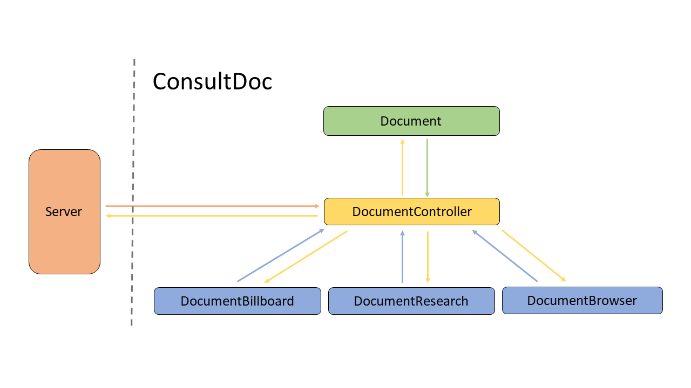

# Architecture

## Description

UDV-Core is split in several components, independent to each other, in order to create an application as modular as possible.
These components are : 
* **GuidedTour controller**
* **Temporal controller**
* **Extended document**
* **Contribute**

*A [class diagram of udv-core](https://github.com/MEPP-team/RICT/tree/master/Doc/Devel/Architecture/Diagrams/UDVcoreClassDiagram.jpg) can be found in the link below:*

Modules are based on a **MVC architecture**. MVC stands for **Model-View-Controller**:
* the **view** is in charge of displaying models and getting user's action;
* the **controller** is in charge of handling events from the view, communicate with the server to get information and data and create the correct models;
* the **model** represents a back-end object.

## ConsultDoc module

The **ConsultDoc module** handles different types of visualization of documents, such as **billboard mode**, **browser mode** or **attached mode**.
It also can allows the user to make a research using several filters, for instance a keyword research or publication research.

*  __Model__ : *Extended*Document
* __Controller__ : *DocumentController*
*  __Views__ : *DocumentBrowser*, *DocumentBillboard*, *DocumentResearch*, *DocumentPlacement*

*The scheme below shows structure and interaction inside **Contribute***:

## Contribute module

The **Contribute module** is composed of several functionalities such as the *creation*, *deletion* or *updating* of documents 
It uses **Document module** to display documents, which would be modify or delete and to handle the creation of a new document.

* __Controller__ : *ContributeController*
* __Views__ : *ContributeCreate, ContributeUpdate*

*The scheme below shows structure and interaction between **Contribute** and how it uses **Document module***:

## Authentication module

### Goal

The goal of the **Authentication module** is to allow basic authentication capabilities such as :

* Creating a user
* Log in as a user
* Make authorized requests with this user

In order to do that, it uses the OAuth2 protocol. When a user enters its username and password into the login module, it sends the credentials to the server which, if the credentials are correct, responds with an token. The token is stored in the client session so it can be used as a way to access protected resources. The format used by the token is JWT (for JSON Web Token).

### Architecture

The code is separated in two main parts : the view and the service. It ressembles to a classic MVC pattern but the view and the controller are coupled, and the model is represented as the service. The model must contain the application logic, so it makes the requests to the server. The workflow is as it follows :

* The user makes an action on the view (login, register)
* The view calls the correct method in the service
* The service makes the appropriate request to the server, and processes the received data
* It then notifies the listeners. The service follows a simple implementation of the [Observer pattern](https://en.wikipedia.org/wiki/Observer_pattern) where observers are just callbacks without arguments (called listeners). The view has subscribed to the service when it was created, so it received the notification of the service and can update itself.

### Services

The service can be used by other modules to retrieve information about the logged in user. It is for example useful to make requests (with the authorization token) or display data (like the name). For instance, the [Request Service](https://github.com/MEPP-team/UDV/wiki/Request-Service) can use the Authorization Service to inject the JWT in HTTP requests.
